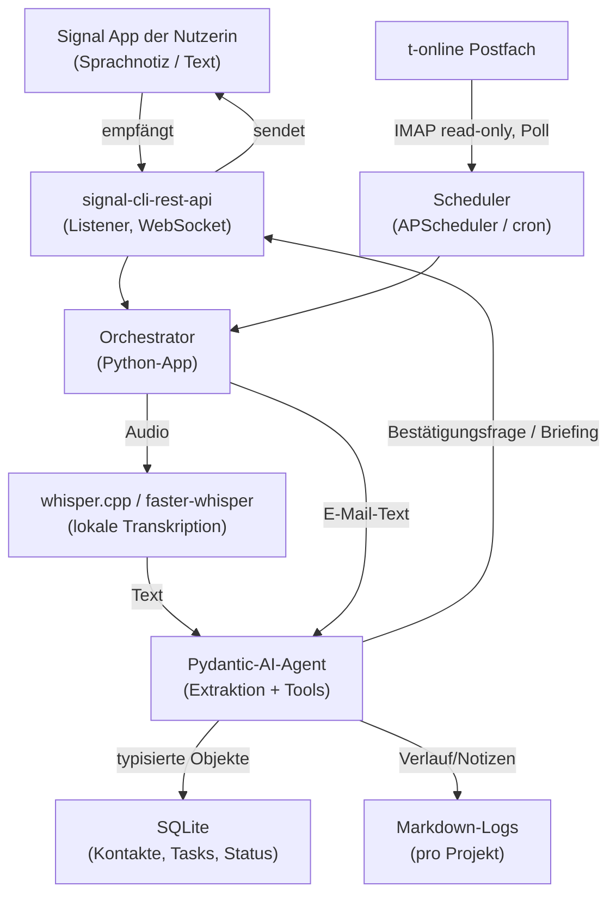

# Planungsdokument: KI-Projektassistent für eine selbstständige Landschaftsarchitektin

*Stand: 29. Juni 2026 · Status: Konzept / MVP-Planung · Autor: Jo*

---

## 1. Ziel & Charakter des Projekts

Ein persönlicher KI-Assistent, der einer selbstständigen Landschaftsarchitektin hilft, **den Überblick über laufende Projekte und Kommunikation zu behalten** — ohne dass sie ein System manuell pflegen muss. Informationen aus ihren bestehenden Kanälen (Sprachnotizen, E-Mail) werden automatisch in strukturierte Aufgaben, Kontakte und Projektstände überführt.

**Charakter:** Dies ist ein **Lern- und Experimentierprojekt**, kein skalierbares Startup. Primärziele sind:

- praktische Anwendungserfahrung mit KI-Agenten im **datenschutzregulierten deutschen Raum**,
- herausfinden, ob sich für eine reale Nutzerin ein echter Mehrwert bauen lässt,
- bewusst klein und lokal anfangen, später ggf. auf einen VPS migrieren.

**Teststrategie (wichtig):** Der gesamte Workflow wird zuerst **mit Jos eigenem Signal-Konto und erfundenen „Fake"-Projekten** erprobt — nicht direkt mit echten Kunden- oder Gemeindedaten. Ein **lokales LLM** dient in dieser Phase nur dem grundsätzlichen Testen des Ablaufs (Funktioniert die Kette? Werden Aufgaben sinnvoll extrahiert?); die Qualitäts-/Datenschutzentscheidung Cloud vs. lokal kommt erst danach. So bleibt der Einstieg risikofrei und ohne personenbezogene Echtdaten.

Das **physische Notizbuch wird nicht ersetzt**, sondern ergänzt. Der Assistent soll Reibung reduzieren, nicht einen neuen Pflegeaufwand schaffen.

---

## 2. Nutzerin & Problem

**Profil:** Selbstständige Landschaftsarchitektin, Schwerpunkt Planung (teils Umsetzung über Workshops oder einen kooperierenden Gärtner). Kunden: Privatpersonen und Gemeinden. Genug Aufträge, kein Akquiseproblem.

**Schmerzpunkt:** Projektmanagement. Sie verliert den Überblick — besonders darüber, **bei wem sie sich noch melden muss** (E-Mail, WhatsApp). Sie arbeitet mit einem Notizbuch und farbigen Zetteln; das funktioniert teilweise, aber nicht alles wird übertragen, und die manuellen Schritte sind aufwendig.

**Kritische Erkenntnis:** Excel-Tabelle und Kanban-Board wurden bereits versucht und **wieder aufgegeben — weil sie manuelle Pflege erforderten.** Das ist die wichtigste Designvorgabe (siehe Abschnitt 3). Jede Lösung, die Disziplin beim Dateneintragen verlangt, wird denselben Tod sterben.

---

## 3. Designprinzipien (nicht verhandelbar)

1. **Passive Erfassung statt manueller Eingabe.** Der Assistent zieht Informationen aus Kanälen, in denen sie ohnehin kommuniziert (Sprachnotiz, E-Mail). Er verlangt kein „Datenpflegen".
2. **Sprache als primäre Eingabe.** Eine Sprachnotiz „runterquatschen" hat die niedrigste Hürde — niedriger als das Notizbuch. Das ist der Kern, nicht ein Add-on.
3. **Bestätigungs-Loop (Human-in-the-loop).** Der Assistent legt nichts unkontrolliert an. Er extrahiert, schlägt vor, fragt kurz zur Bestätigung. Quittierung per **Emoji-Reaktion** (z. B. Daumen hoch) und bei mehreren Optionen per **nummerierter Auswahl**. Bei Unklarheiten **fragt er nach**, statt zu raten. Vertrauen entsteht durch Kontrolle.
4. **Das Notizbuch bleibt.** Optional kann später eine abfotografierte Seite per OCR aufgenommen werden — als Ergänzung, nicht als Ersatz.
5. **Lokal-first & Datensparsamkeit.** So wenig personenbezogene Daten wie möglich verlassen die Maschine. Was lokal verarbeitet werden kann (Audio), wird lokal verarbeitet.
6. **Erfolgskriterium:** Nicht „guter Agent", sondern *„sie nutzt es freiwillig weiter, ohne Aufforderung"*.

---

## 4. Scope: MVP vs. später

| Funktion | Phase | Begründung |
|---|---|---|
| Sprachnotiz → Aufgaben/Kontakte extrahieren + Bestätigung | **MVP** | Höchster Nutzen, geringste Hürde, zentral für Designprinzip 2 |
| Kunden-/Kontaktdatenbank + Projektstatus | **MVP** | Kern — ohne sie keine „bei wem muss ich mich melden?"-Antwort |
| Signal als Ein-/Ausgabekanal | **MVP** | Rechtlich/technisch sauber, Sprachnachrichten möglich |
| E-Mail-Extraktion (t-online IMAP, read-only) | **Phase 2** | Zweite Quelle; sinnvoll, sobald Kern läuft |
| Tägliches Briefing („wer wartet, was ist fällig") | **Phase 2** | Baut auf DB + E-Mail auf |
| Statusabfragen per Chat („Was ist offen bei Familie Müller?") | **Phase 2** | Nutzt vorhandene DB |
| Kalender-Integration | **Phase 3** | Erst wenn Tasks/Status stabil sind |
| Notizbuch-OCR | **Phase 3** | Nice-to-have |
| WhatsApp | **bewusst zurückgestellt** | Siehe Abschnitt 8 — rechtlich/technisch problematisch |

---

## 5. Architektur (lokal-first)

Drei klar getrennte Verantwortlichkeiten: **„Ohr & Wecker"** (Listener/Scheduler), **„Gehirn"** (Agent), **„Gedächtnis"** (Speicher). Diese Trennung hält den Code übersichtlich und macht jeden Datenfluss explizit — wichtig fürs DSGVO-Lernziel.



**Ablauf einer Sprachnotiz:** Signal empfängt die Audionachricht → Orchestrator reicht sie an whisper.cpp (lokal) → transkribierter Text geht an den Pydantic-AI-Agenten → Agent extrahiert typisierte `Task`/`Contact`/`ProjectUpdate`-Objekte, schreibt sie in SQLite + Markdown-Log → Agent antwortet via Signal mit einer kurzen Bestätigung zum Abnicken.

---

## 6. Datenmodell (Entwurf)

Pydantic-Modelle dienen gleichzeitig als **LLM-Output-Schema** und als Grundlage des **DB-Schemas** (SQLite). So bleibt beides konsistent. Erster Entwurf:

### Contact

| Feld | Typ | Beschreibung |
|---|---|---|
| `id` | int (PK) | |
| `name` | str | Name / Familie / Ansprechpartner |
| `type` | enum | `privat` \| `gemeinde` \| `dienstleister` (z. B. Gärtner) |
| `email` | str? | |
| `phone` | str? | |
| `channel` | enum? | bevorzugter Kanal |
| `notes` | str? | Freitext |
| `created_at` / `updated_at` | datetime | |

### Project

| Feld | Typ | Beschreibung |
|---|---|---|
| `id` | int (PK) | |
| `title` | str | Projektname |
| `contact_id` | int (FK → Contact) | Hauptkontakt |
| `status` | enum | `anfrage` \| `planung` \| `umsetzung` \| `pausiert` \| `abgeschlossen` |
| `phase_note` | str? | aktueller Stand in einem Satz |
| `markdown_log_path` | str | Pfad zum Verlaufs-Log |
| `next_action` | str? | nächster offener Schritt |
| `waiting_on` | enum? | `ich` \| `kunde` \| `dienstleister` — für „bei wem muss ich mich melden?" |
| `created_at` / `updated_at` | datetime | |

### Task

| Feld | Typ | Beschreibung |
|---|---|---|
| `id` | int (PK) | |
| `title` | str | Aufgabentext |
| `project_id` | int? (FK) | optional zugeordnet |
| `contact_id` | int? (FK) | optional |
| `due` | date? | Fälligkeit |
| `status` | enum | `offen` \| `erledigt` \| `verworfen` |
| `source` | enum | `sprachnotiz` \| `email` \| `chat` \| `manuell` |
| `source_ref` | str? | Verweis auf Originalnachricht (z. B. Mail-Message-ID) |
| `depends_on` | list[int] | Vorgänger-Aufgaben (Task-IDs). Aufgabe ist erst „startbar", wenn alle erledigt sind. Bildet auch externe Blocker ab (z. B. Aufgabe „Mahdtermin klären") |
| `time_window` | str? | Saisonales/zeitliches Fenster, Freitext (z. B. „vor der ersten Mahd, ca. Mai–Juni"). Optional ergänzt um `window_start`/`window_end` als Datum, sobald bekannt |
| `created_at` | datetime | |

### CommunicationLog (optional, Phase 2)

Sammelt eingehende E-Mails/Nachrichten je Kontakt/Projekt (Absender, Datum, Betreff, Auszug, Verweis). Wichtig: Hier liegen **personenbezogene Daten Dritter** — Datensparsamkeit beachten (Auszug statt Volltext, Aufbewahrungsfrist definieren).

> **Pydantic-Beispiel (Extraktion):**
> ```python
> class ExtractedTask(BaseModel):
>     title: str
>     contact: str | None
>     due: date | None
>     project: str | None
>
> agent = Agent("anthropic:claude-...", output_type=list[ExtractedTask])
> result = agent.run_sync(transkribierter_text)  # result.output: list[ExtractedTask]
> ```

### Abhängigkeiten & saisonale Zeitfenster

Viele Aufgaben hängen an Jahreszeit/Wetter und an anderen Aufgaben (Beispiel: eine Wiese muss **kartiert werden, bevor sie gemäht wird** — und der Mahdtermin liegt beim Grundstücksbesitzer). Das wird über zwei Felder am `Task`-Modell abgebildet, bewusst ohne eigene Constraint-Engine:

- **`depends_on`** — vereinheitlicht *beide* Arten von Blockern: echte Vorgänger-Aufgaben *und* externe Klärungen. Statt eines separaten „extern blockiert"-Flags wird z. B. „Mahdtermin mit Besitzer klären" zu einer eigenen, sichtbaren Aufgabe, die der Kartierung vorausgeht. Vorteil: Koordination steht in ihrer Aufgabenliste statt in einem versteckten Feld.
- **`time_window`** — das saisonale Fenster als Freitext (optional mit konkreten Datumsgrenzen). Ein zusätzliches „saisonsensibel"-Flag ist überflüssig: Ein gesetztes Fenster *ist* das Signal.

**Verhaltenslogik (Tool, nicht Schema):** Wird die Klärungs-Aufgabe erledigt und das Datum eingesprochen, zieht der Agent das `window_end` der abhängigen Aufgabe nach — so schließt sich die Kette. Edge case: reine Bedingungen ohne Handlung (z. B. „Boden nicht mehr gefroren") werden als triviale Prüf-Aufgabe oder als Freitext im `time_window` abgebildet.

**Wichtige Abgrenzung:** Der Agent *plant* nicht autonom (er kennt Wetter/Mahdtermin nicht) — sein Wert ist das **rechtzeitige Erinnern** („Fenster Mai/Juni, Mahdtermin noch offen → jetzt klären"). Das proaktive Anstupsen gehört zu **Phase 2** (Scheduler + Tagesbriefing); im MVP werden Abhängigkeiten und Fenster nur gespeichert.

---

## 7. Komponenten im Detail

**Kanal-Layer — Signal.** `signal-cli-rest-api` (dockerisiert) wird als *Linked Device* mit ihrer bestehenden Signal-Nummer verbunden (wie Signal Desktop; ihr Handy bleibt Hauptgerät, keine neue Nummer). Empfang in Echtzeit per WebSocket/JSON-RPC, Senden per POST, Medien (Sprachnachrichten) in beide Richtungen. Hinweis: persönliches Konto, kein offizielles Bot-Produkt — für ein Einzelnutzer-Experiment unkritisch, bei Skalierung neu zu bewerten.

**Transkription — Whisper, lokal.** Auf Apple-Silicon-MacBook-Air nutzt **whisper.cpp** Metal-GPU + Neural Engine; alternativ **faster-whisper** rein auf CPU. Modell `medium` empfohlen (bessere Erkennung von Eigen-/Ortsnamen bei Kunden/Gemeinden). Keine dedizierte GPU nötig. Vorteil: Audio (potenziell mit Drittpersonen-Daten) verlässt die Maschine nie.

**Brain — Pydantic AI.** Python-Agenten-Framework. Strukturiert die LLM-Interaktion über Typen: definiertes Pydantic-Modell → automatisches JSON-Schema → validiertes Python-Objekt zurück. Tools (Funktionen, die der Agent aufrufen darf): `upsert_contact`, `create_task`, `update_project_status`, `query_open_items`. Modellunabhängig (Cloud oder lokal via Ollama). Kein eingebauter Scheduler — siehe unten.

**E-Mail — t-online IMAP (read-only).** Server `secureimap.t-online.de`, Port 993, SSL. Kein OAuth nötig (Vorteil ggü. Gmail) — nur ein im Telekom-Kundencenter erzeugtes „E-Mail-Passwort". Verbindung strikt lesend (nichts markieren/verschieben).

**Speicher.** **SQLite** für strukturierte Daten (Kontakte, Projekte, Tasks — beantwortet zuverlässig „was ist offen?"). **Markdown-Log pro Projekt** für Verlauf/Notizen (transparent, gut als Agenten-Kontext). Bewusst *kein* großes externes PM-Tool im MVP.

**Scheduler / Listener.** Pydantic AI hat **keinen** Cron. Zeitsteuerung eine Ebene tiefer:
- **Listener** (Dauerprozess): lauscht auf Signal, ruft bei Eingang den Agenten auf.
- **Scheduler** (`APScheduler` lokal, später `cron`/`systemd timer`): pollt IMAP alle X Minuten, erzeugt das Tagesbriefing um z. B. 7 Uhr.

*(Pydantic AIs „Durable Execution" ist etwas anderes: Robustheit langlaufender Workflows über Abstürze/Neustarts hinweg — nicht Zeitsteuerung.)*

---

## 8. Warum WhatsApp (vorerst) nicht

- Seit **15.01.2026 verbietet Meta universelle KI-Chatbots** auf der WhatsApp Business Platform; nur task-orientierte, prozessgebundene Flows sind erlaubt.
- Die Business API erfordert eine **dedizierte Nummer** (nie privat genutzt) + Meta-Verifizierung (1–6 Wochen).
- Eingehende Kundennachrichten kämen nur über diese Business-Nummer — ihre Kunden schreiben aber auf ihre **private** Nummer. Migration = großer Reibungsverlust; inoffizielles Anzapfen = ToS-Verstoß + Sperrgefahr.

**Konsequenz:** Signal ersetzt WhatsApp als Assistenz-Kanal. WhatsApp-Erfassung bleibt zurückgestellt, bis es einen sauberen Weg gibt.

---

## 9. DSGVO- & EU-AI-Act-Checkliste

Der **LLM-Extraktionsschritt ist die zentrale Datenschutzentscheidung**, nicht die Frameworkwahl. Sobald berufliche E-Mails/Nachrichten verarbeitet werden, ist die Nutzerin **Verantwortliche**; verarbeitest du in ihrem Auftrag, bist du **Auftragsverarbeiter**.

- [ ] **Rollen klären:** AVV (Auftragsverarbeitungsvertrag) zwischen dir und der Nutzerin — auch im Experiment gute Übung.
- [ ] **LLM-Anbieter:** Bei Cloud-LLM (Claude/GPT) AVV mit dem Anbieter + möglichst EU-/DE-Datenverarbeitung. Alternative für Hard-Mode: **lokales Modell via Ollama** (geringere Qualität, aber Daten bleiben lokal).
- [ ] **Audio lokal** transkribieren (whisper.cpp) — kein Audio in die Cloud.
- [ ] **Datensparsamkeit:** Nur speichern, was nötig ist (Auszüge statt Volltext-Mails); Aufbewahrungs-/Löschfristen definieren.
- [ ] **EU-AI-Act-Transparenz:** Der Assistent muss sich **als KI zu erkennen geben** (relevant v. a., falls je Kunden direkt mit ihm interagieren — im MVP interagiert nur die Nutzerin selbst).
- [ ] **Gemeinde-Daten** besonders sensibel behandeln (öffentliche Stellen).
- [ ] **Zugangsdaten/Tokens sicher ablegen** (E-Mail-Passwort, Signal-Link, LLM-API-Key) — nicht im Klartext im Repo; Secrets-Management.
- [ ] **Hosting:** lokal (Air) bzw. später **deutscher VPS** (z. B. Hetzner) statt US-Cloud.
- [ ] **Transportverschlüsselung** für alle Verbindungen (IMAP SSL, API HTTPS).

---

## 10. Tech-Stack (Zusammenfassung)

| Schicht | Wahl | Alternative |
|---|---|---|
| Kanal | signal-cli-rest-api (Docker) | — |
| Transkription | whisper.cpp (Apple Silicon) | faster-whisper (CPU) |
| Agenten-Brain | Pydantic AI | OpenAI/Anthropic SDK direkt |
| LLM | Cloud (Claude/GPT) + AVV | lokal via Ollama (Qwen/Llama) |
| Strukturierter Speicher | SQLite | — |
| Verlauf | Markdown-Dateien | — |
| Scheduler | APScheduler (lokal) | cron / systemd timer (VPS) |
| Sprache | Python 3.12+ | — |
| Hosting | MacBook Air → Hetzner VPS (DE) | — |

---

## 11. Roadmap (3 Phasen)

**Phase 0 — Eigener Trockenlauf.** Workflow zuerst mit **Jos eigenem Signal-Konto und Fake-Projekten** testen, lokales LLM zum Validieren der Kette. Keine echten Kunden-/Gemeindedaten. Ziel: Funktioniert Signal → Whisper → Extraktion → DB → Bestätigung überhaupt sauber?

**Phase 1 — Sprachnotiz-Kern (MVP).** Signal-Anbindung, lokale Transkription, Pydantic-AI-Extraktion, SQLite + Markdown, Bestätigungs-Loop via Signal (Emoji/nummerierte Auswahl). Läuft komplett auf dem Air. *Ziel: Sie spricht eine Notiz ein und bekommt strukturierte, bestätigte Aufgaben/Kontakte zurück.* Erfolgstest: Nutzt sie es 2–3 Wochen freiwillig?

**Phase 2 — E-Mail & Übersicht.** t-online-IMAP read-only, Task-Extraktion aus Mails, Tagesbriefing („wer wartet auf Antwort, was ist fällig"), Statusabfragen per Chat. *Ziel: Der Assistent beantwortet „bei wem muss ich mich melden?".*

**Phase 3 — Erweiterung & Betrieb.** Kalender-Integration, optional Notizbuch-OCR, Migration auf Hetzner-VPS für „immer erreichbar", Härtung (Secrets, Backups, Monitoring/Logfire).

---

## 12. Entscheidungen & offene Punkte

**Bereits entschieden:**

1. **LLM lokal vs. Cloud:** Lokales LLM dient zunächst nur dem **Testen des Workflows** (siehe Phase 0). Die endgültige Qualitäts-/Datenschutzentscheidung fällt erst nach dem Trockenlauf.
2. **Bestätigungs-UX:** **Emoji-Reaktion** (Daumen hoch) als Standard, **nummerierte Auswahl** bei mehreren Optionen.
3. **Datenmodell-Detailtiefe:** Bewusst **minimal anfangen**, bei Bedarf verfeinern.
5. **Mehrdeutigkeit:** Der Agent **fragt nach**, statt zu raten oder stumm zu parken.
7. **Onboarding bestehender Projekte:** Sobald E-Mail-Kontakt besteht (Phase 2), **minet** der Agent das Postfach nach Projekten und stellt ihr in einem **strukturierten Prozess gezielte Rückfragen zu Lücken in der Datenbank**. Ergänzend jederzeit per Sprachnachricht.

**Noch zu klären (später):**

4. **Aufbewahrung/Löschung:** Wie lange werden Mail-Auszüge/Logs gehalten? — wird später festgelegt.
6. **Backup/Recovery** der SQLite-DB und Markdown-Logs — relevant spätestens beim Umzug auf den VPS.

---

## 13. Risiken

- **Adoptionsrisiko (größtes):** Sie pflegte frühere Systeme nicht. Gegenmittel = Designprinzipien 1–3 strikt einhalten; früh und ehrlich testen.
- **Extraktionsqualität:** Falsch erkannte Namen/Aufgaben untergraben Vertrauen → Bestätigungs-Loop + ggf. größeres Whisper-Modell.
- **Datenschutz:** Drittpersonen-Daten (Kunden, Gemeinden) im LLM-Schritt → lokale Optionen + AVV ernst nehmen.
- **Betrieb/Verfügbarkeit:** Listener muss laufen, damit Signal empfangen wird → für „immer erreichbar" VPS nötig; bis dahin klar kommunizieren, dass es nur läuft, wenn der Rechner an ist.
- **Scope Creep:** Versuchung, früh WhatsApp/Kalender/PM-Tool-Integration zu bauen → Phasenplan einhalten.

---

## Quellen / Referenzen

- Meta AI Provider Policy (WhatsApp): https://developers.facebook.com/documentation/business-messaging/whatsapp/pricing/ai-providers
- WhatsApp AI Policy 2026 (Übersicht): https://www.alibabacloud.com/help/en/chatapp/use-cases/whatsapp-ai-policy-2026-guide
- WhatsApp Business DSGVO: https://qualimero.com/en/blog/whatsapp-business-gdpr · https://www.wbs.legal/it-und-internet-recht/datenschutzrecht/whatsapp-business/
- t-online IMAP/Server: https://www.telekom.de/hilfe/apps-dienste/e-mail/posteingang-postausgang-server · https://smtpedia.com/t-online-de-email-settings-pop3-imap-and-smtp/
- signal-cli-rest-api: https://github.com/bbernhard/signal-cli-rest-api · Signalbot: https://signalbot-org.github.io/signalbot/latest/getting_started/
- Pydantic AI: https://pydantic.dev/docs/ai/overview/ · https://github.com/pydantic/pydantic-ai
